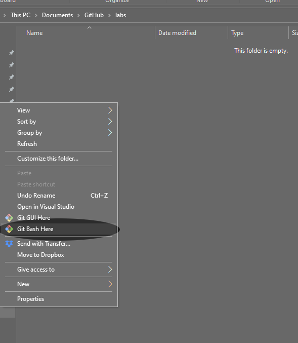
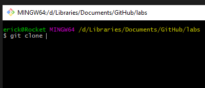

# How to clone a Repository

In this brief tutorial, you will learn how to clone a repository from GitHub. This tutorial does make one assumption.

* You have installed Git Bash on a Windows machine. You can find instructions for installing Git [here](https://git-scm.com/).

## What is Git?

Git is a version control system. When you are working on a large project with many files, it is important to be able to keep track of everything in a neat and organized way. Let's say you have an app that is currently working and you want to add a new feature. Rather than work directly on code that you _know_ is working, you can use git to create a new **branch** of your code to implement, integrate, and (most importantly) test your new feature before **merging** it back with your main working code base.

In this course, we will use Git as our primary way to acquire lab files. This will allow you to practice with an important industry tool in a way that doesn't require you to know all of the ins and outs of it. Because Git is a very complex tool with many features and pitfalls, we will use it in this limited way to gain confidence.

## What is GitHub

GitHub is a git hosting service. Using the Git command line interface, and a GitHub account, you can store your code online in a **repository**, which is a sort of container which contains your entire code base, all of its files, versions, and branches. GitHub is a feature rich tool which allows you to store your code in public or private repositories for sharing or storage. It also has features that allow you to suggest edits to someone else's public repositories, or work with a team collaboratively on a project. Again, we are not going to use all of GitHub's many features, but we will use it to copy lab files to your local machine, and later in the term, you will use it to upload your solutions to your own repositories and submit those for grading.

## How to clone a repository

1. First, open a browser to the repository you wish to clone. To practice, try this [practice repository](https://github.com/SirYancy/test).

1. Next open your windows file manager to your labs folder. In the labs folder, right-click **Git Bash Here**. Note: if this option is not available in the right-click menu, then either git did not install correctly or something else went wrong. Attempt to re-install the git interface or see the instructor.

    

1. Now, in the Git command-line interface, type `git clone` followed by a space, but do not press Enter yet.

    

1. Next, click back over to the web browser window where you have the code repository open and click the green button that says **Code**, select the tab here that says **HTTPS**, and then copy the URL to your system clipboard, by clicking the clipboard icon next to the URL.

    

1. Back in your Git Bash window, you need to paste the URL to the end of the command. To do this, you can right-click in the Bash window and select **Paste** or, you can use the keyboard shortcut which you'll see is **Shift-Insert**.

    

1. Finally, press **Enter** on your keyboard to initiate the clone. You'll see some text scroll in the Bash window, and once that's finished the folder with the name of the repository appear in your file browser.

    

    And if you navigate into that folder, you will notice that it has all of the files that were originally in the repository here. If you have hidden files enabled, you will see a folder in here called `.git`. This folder contains all of the files and metadata associated with the git repository. Ignore these. If you mess with them, you *will* corrupt the repository.

    

## What just happened?

In Git, all commands start with the keyword `git`. You executed the `git clone` command with a web URL as a parameter. What this tells Git to do is access the web, locate that the URL and, if there's a repository there, copy the entire main branch of the repository to the local machine for reading, editing, or executing. That said, there are a few things that you cannot do with this repository. You cannot make changes and push them back unless you are the owner of the repository or have been given access to do so. We will be learning how to do these things later in the term. For now, this is all you need to know. We'll see you in the first lab!
